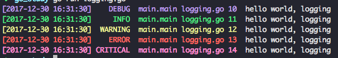

### Golang logging library
--------------------------

Package logging implements a logging infrastructure. It supports different
MessageHandler like StreamHandler for console and FileHandler for file output;
Every MessageHandler can have different MessageFormatter and MessageFilter.

### Example



```go
package main

import (
	"github.com/gamelife1314/logging"
	"os"
)

func main() {
	logger := logging.GetDefaultLogger()
	logger.DEBUG("hello world, %s", "logging")
	logger.INFO("hello world, %s", "logging")
	logger.WARNING("hello world, %s", "logging")
	logger.ERROR("hello world, %s", "logging")
	logger.CRITICAL("hello world, %s", "logging")

	logFile, _ := os.OpenFile("log.log", os.O_APPEND|os.O_CREATE|os.O_WRONLY, 0666)
	logger2 := &logging.Logger{
		Level: logging.DEBUG,
		StreamHandler: &logging.StreamMessageHandler{
			Level: logging.DEBUG,
			Formatter: &logging.MessageFormatter{
				Format:     `{{.Color}}[{{.Time}}] {{.LevelString | printf "%8s"}}  {{.FuncName}} {{.ShortFileName}} {{.Line}} {{.ColorClear}} {{.Message}}`,
				TimeFormat: "2006-01-02 15:04:05",
			},
			Destination: os.Stdout,
		},
		FileHandler: &logging.FileMessageHandler{
			Level: logging.ERROR,
			Formatter: &logging.MessageFormatter{
				Format: "[{{.Time}}] {{.LevelString}}  {{.Pid}} {{.Program}} {{.FuncName}} {{.LongFileName}} {{.Line}}{{.Message}}\n",
			},
			Destination: logFile,
		},
	}
	logger2.DEBUG("hello world")
}

```


### Installing
--------------

1. using go get, `go get github.com/gamelife1314/logging`

2. update: `go get -u github.com/gamelife1314/logging`


### Documentation
-----------------

1. see [http://godoc.org/github.com/gamelife1314/logging](http://godoc.org/gamelife1314/logging)

2. or run command: `godoc github.com/gamelife1314/logging`